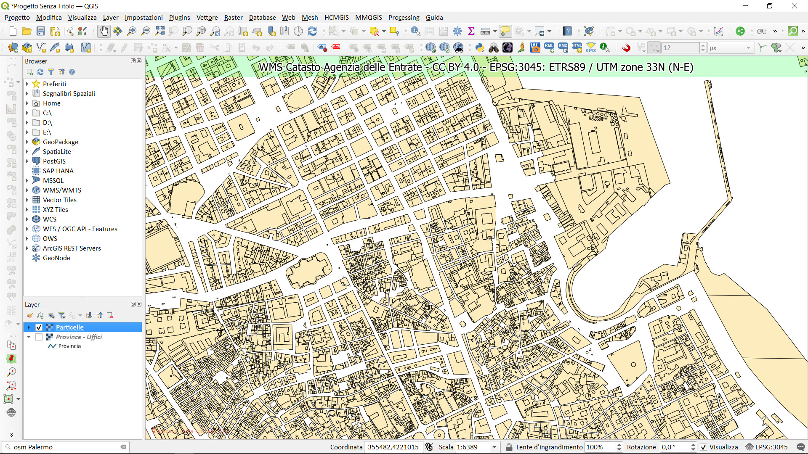
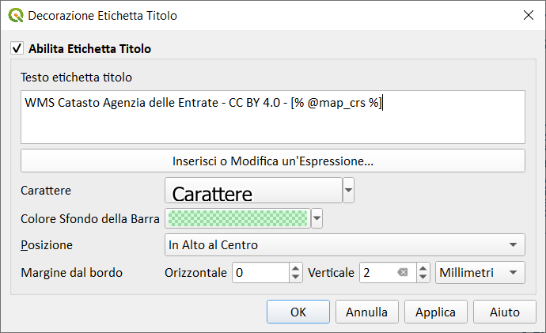

# Workshop estate GIS 2021 UNIPD

**INDICE**

<!-- TOC -->

- [Workshop estate GIS 2021 UNIPD](#workshop-estate-gis-2021-unipd)
  - [Relatori](#relatori)
  - [Data, luogo e durata](#data-luogo-e-durata)
  - [Piattaforme e Software](#piattaforme-e-software)
  - [Programma - in lavorazione](#programma---in-lavorazione)
  - [QGIS e il WMS AdE](#qgis-e-il-wms-ade)
  - [Dati](#dati)
    - [servizio WMS](#servizio-wms)
    - [link utili](#link-utili)
  - [Contatti](#contatti)
    - [Contatti Andrea Borruso](#contatti-andrea-borruso)
      - [Sitografia](#sitografia)
    - [Contatti Totò Fiandaca](#contatti-totò-fiandaca)
      - [Sitografia](#sitografia-1)
- [Workshop WMS Catasto AdE in QGIS](#workshop-wms-catasto-ade-in-qgis)
  - [Decorazione Etichetta Titolo](#decorazione-etichetta-titolo)
    - [Espressione calcolatore di campi](#espressione-calcolatore-di-campi)
  - [Servizio WMS](#servizio-wms-1)
    - [SR disponibili per il WMS](#sr-disponibili-per-il-wms)
    - [Layer disponibili nel WMS](#layer-disponibili-nel-wms)
  - [Espressione personalizzata](#espressione-personalizzata)
  - [campi virtuali](#campi-virtuali)
    - [EDIT](#edit)
    - [Video demo:](#video-demo)
- [Caratteristiche utilizzate nel progetto](#caratteristiche-utilizzate-nel-progetto)
- [Riferimenti utili](#riferimenti-utili)
- [Cosa c'è in questo repo](#cosa-cè-in-questo-repo)

<!-- /TOC -->

---

**TITOLO**: <br> Il WMS del catasto dell'Agenzia delle Entrate: licenza, come usarlo in [QGIS](https://qgis.org/it/site/):aggiungi WMS, estrazione dati e digitalizzazione particelle.

**DESCRIZIONE**: <br> Obiettivo di questo workshop è quello di evidenziare le potenzialità delle analisi geografiche usando **opendata** e software **Open Source**. Realizzeremo un progetto **QGIS** utilizzando, come fonte dei dati, il WMS dell'AdE e vedremo come utilizzare il WMS, come estrarre i dati esposti usando il filed calc, e infine come digitalizzare velocemente le particelle catastali usando vari plugin.

<p align="center"><a href="https://www.mastergiscience.it/it_IT/2020/06/01/estate-gis-2020/" target="_blank"></a></p>

---


[](https://github.com/pigreco/seminario-estate-gis-2020/blob/master/license)
[](https://github.com/pigreco/seminario-estate-gis-2020/commits/master)

## Relatori

- 🧔 **Andrea BORRUSO** <br>(Membro [OpenDataSicilia](http://opendatasicilia.it/) (2014), Presidente [onData](https://ondata.it/) (2015),... )

<p align="center"><a href="" target="_blank"></a></p>

- 👨‍🦲 **Totò FIANDACA** <br>(Membro [OpenDataSicilia](http://opendatasicilia.it/) (2014) , Membro [QGIS Italia](http://qgis.it/) (2015), Socio [GFOSS.it](https://gfoss.it/) (2017), Membro [QGIS organization](https://github.com/qgis) (2020))

<p align="center"><a href="" target="_blank"></a></p>

## Data, luogo e durata

- 🗓 09/06/2021 con orario  🕟 17.30 🕢 19.30 
- 🌐 on-line
- ⏳ due ore

## Piattaforme e Software

- [ZOOM](https://zoom.us/) - per diretta web
- Windows 10 64b - come SO
- [`QGIS 3.16 Hannover`](https://qgis.org/it/site/)  e Plugin [`Gimp Selection feature`](https://github.com/lmotta/gimpselectionfeature_plugin/wiki) e [`Magic Wand`](https://plugins.qgis.org/plugins/MagicWand-master/)

## Programma - in lavorazione

1. Presentazione iniziale da parte degli organizzatori;
2. Andrea Borruso:
   1.  introduce gli opendata;
   2.  il WMS del Catasto Dell'AdE: la licenza prima e dopo del 24/09/2020;
   3.  cosa possiamo farci con il WMS: con QGIS o via script;
3. Totò Fiandaca:
   1. esempi di uso del WMS dell'AdE in QGIS:
   2. come creare collegamento la WMS;
   3. come usarle il WMS come layer;
   4. quali layer sono presenti nel WMS e a quale scala sono visibili;
   5. come interrogare il WMS;
   6. quali dati espone il WMS;
   7. come estrarre i dati esposti dal WMS;
   8. come creare/usare espressioni personalizzate;
   9. come digitalizzare le particelle in modo veloce;
   10. quali plugin usare per estrarre le particelle;
   11. 

[↑ torna su ↑](#workshop-estate-gis-2021-unipd)

## QGIS e il WMS AdE



[↑ torna su ↑](#workshop-estate-gis-2020-unipd)

## Dati

### servizio WMS

- **URL servizio WMS** : https://wms.cartografia.agenziaentrate.gov.it/inspire/wms/ows01.php
- **PDF su WMS** : <https://www.agenziaentrate.gov.it/portale/documents/20143/260417/Manuale+consultazione+cartografia_Documentazione+descrittiva+del+servizio+di+consultazione+della+cartografia+catastale+20180611.pdf/35e955f7-2344-56c8-1157-8f7567531660>
- **Capabilities** : <https://wms.cartografia.agenziaentrate.gov.it/inspire/wms/ows01.php?SERVICE=WMS&VERSION=1.3.0&REQUEST=GetCapabilities>

### link utili

- **Pagina con URL e licenza** : https://www.agenziaentrate.gov.it/portale/web/guest/schede/fabbricatiterreni/consultazione-cartografia-catastale/servizio-consultazione-cartografia
- **espressione personalizzata**: <https://gist.github.com/pigreco/86589dddf5a59b3a7650267d5af237bd>

---

## Contatti

### Contatti Andrea Borruso

* **Mail**: <@gmail.com>
* **Facebook**: <https://www.facebook.com/.....>
* **Twitter**: <https://twitter.com/.....>

#### Sitografia

* **blog**: <https://..../>


### Contatti Totò Fiandaca

* **Mail**: <pigrecoinfinito@gmail.com>
* **Facebook**: <https://www.facebook.com/pigreco314>
* **Twitter**: <https://twitter.com/totofiandaca>

#### Sitografia

* **blog**: <https://pigrecoinfinito.com/>
* **canale youtube**: <http://www.youtube.com/c/TotòFiandaca>
* **HfcQGIS**: <http://hfcqgis.opendatasicilia.it/it/latest/index.html>
* **Tansignari**: <http://tansignari.opendatasicilia.it/it/latest/#>
* **data.world**: <https://data.world/pigrecoinfinito>
* **github**: <https://github.com/pigreco>
* **gitlab**: <https://gitlab.com/pigr3co>
* **Canale Telegram** : <https://t.me/pigrecoinfinito>

[↑ torna su ↑](#workshop-estate-gis-2021-unipd)

# Workshop WMS Catasto AdE in QGIS

## Decorazione Etichetta Titolo

Creare un nuovo progetto QGIS

### Espressione calcolatore di campi

espressione utilizzata: (Menu: Visualizza | Decorazioni | Etichetta Titolo ...)

```python
WMS Catasto Agenzia delle Entrate - CC BY 4.0 - [% @map_crs ||': '|| @map_crs_description %]
```




## Servizio WMS

### SR disponibili per il WMS

Il servizio rende consultabili i dati nel Sistema di riferimento geodetico nazionale (Decreto 10 novembre 2011) costituito dalla realizzazione ETRF2000 - all'epoca 2008.0 - del Sistema di riferimento geodetico europeo ETRS89, identificativo EPSG3:6706.

Ai soli fini di una migliore fruibilità del servizio in ambito INSPIRE, sono disponibili i Sistemi di riferimento relativi alla realizzazione ETRF89 (codici EPSG 4258, 25832, 25833, 25834, 3044, 3045, 3046).

- Capabitilis : <https://wms.cartografia.agenziaentrate.gov.it/inspire/wms/ows01.php?SERVICE=WMS&VERSION=1.3.0&REQUEST=GetCapabilities>
- copiate il link di sopra e incollatelo in un browser, poi cercate EPSG, troverete una lista di EPSG utilizzabili.

map_crs     |   map_crs_description         | Area of fuse                   | Unit
------------|-------------------------------|--------------------------------|--------
EPSG:6706   | RDN2008                       |  Italy - onshore and offshore  | degree 
EPSG:4258   | ETRS89                        |  Europe - onshore and offshore | degree
EPSG:3044   | ETRS89 / UTM zone 32N (N-E)   |  Europe between 06°E and 12°E  | metre
EPSG:3045   | ETRS89 / UTM zone 33N (N-E)   |  Europe between 12°E and 18°E  | metre
EPSG:3046   | ETRS89 / UTM zone 34N (N-E)   |  Europe between 18°E and 24°E  | metre
EPSG:25832  | ETRS89 / UTM zone 32N         |  Europe between 06°E and 12°E  | metre
EPSG:25833  | ETRS89 / UTM zone 33N         |  Europe between 12°E and 18°E  | metre
EPSG:25834  | ETRS89 / UTM zone 34N         |  Europe between 18°E and 24°E  | metre

[↑ torna su ↑](#workshop-estate-gis-2021-unipd)

### Layer disponibili nel WMS

nome | Titolo | Scala visualizzazione | GetFeatureInfo
-----|--------|-----------------------|------------
province | Province - Uffici | 1:50.000| n.d.
CP.CadastralZoning| Mappe | 1:200.000 | Campi previsti dalla Direttiva INSPIRE
acque | Acque | 1:40.000 | n.d.
strade | Strade | 1:40.000 | n.d.
CP.CadastralParcel | Particelle | 1:5.000 | Campi previsti dalla Direttiva INSPIRE
fabbricati | Fabbricati | 1:5.000 | n.d.
vestizione | Vestizione | 1:2.000 | n.d.
copyright | Copyright(c) |

[↑ torna su ↑](#workshop-estate-gis-2021-unipd)

## Espressione personalizzata

```python
# -*- coding: utf-8 -*-
"""
/***************************************************************************
 WMS Catasto Agenzia delle Entrate CC BY 4.0
                              -------------------
        copyright            : (C) 2020 by Giulio Fattori
        email                : giulio.fattori@tin.it
 ***************************************************************************/
"""

from qgis.core import *
from qgis.gui import *
import requests

@qgsfunction(args='auto', group='Custom')
def get_parcel_info2(xx, yy, EPSG, feature, parent):
    """
    <h1>WMS Catasto Agenzia delle Entrate CC BY 4.0:</h1><br>    
    La funzione, tramite una richiesta GetFeatureInfo, restituisce le informazioni utili sulla particella che ricade sotto il pixel di mio interesse:
    <h2>Esempio:</h2>
    <ul>
      <li>get_parcel_info(355461.5,4222490.7,'EPSG:3045') -> 'IT.AGE.PLA.G273_0033A0.673'</li>
      <li>get_parcel_info("fieldX", "fieldY",'EPSG:3045') -> 'IT.AGE.PLA.G273_0033A0.673'</li>
      <li>get_parcel_info("fieldX", "fieldY",@project_crs) -> 'IT.AGE.PLA.G273_0033A0.673'</li>
    </ul>
    <h2>NB: le coordinate X e Y devono essere espresse nel EPSG utilizzato (gli EPSG disponibili sono:25832/3/4,3044/5/6)</h2>
    """
    req = "https://wms.cartografia.agenziaentrate.gov.it/inspire/wms/ows01.php?REQUEST=GetFeatureInfo&SERVICE=WMS&SRS="+EPSG+"&STYLES=&VERSION=1.1&FORMAT=image/png&BBOX="+str(xx-1)+","+str(yy-1)+","+str(xx+1)+","+str(yy+1)+"&HEIGHT=9&WIDTH=9&LAYERS=CP.CadastralParcel&QUERY_LAYERS=CP.CadastralParcel&INFO_FORMAT=text/html&X=5&Y=5"

    r = requests.get(req, auth=('user', 'pass'))
    a = r.text.partition("InspireId localId</th><td>")[2]
    b = a.partition("</td>")[0]
    return b
```

file da salvare nella cartella del profilo corrente: `C:\Users\nomeUtente\AppData\Roaming\QGIS\QGIS3\profiles\default\python\expressions`

raggiungibile da : Menu | Impostazionio | Profilo utente | Apri la cartella del profilo attivo


[↑ torna su ↑](#workshop-estate-gis-2021-unipd)

## campi virtuali

sotto le espressioni utilizzate nei campi virtuali

Creare un vettore puntuale, per esempio in un GeoPackage e definire solo il campo `fid`, gli altri campi li definiamo come `campi virtuali`, ecco le definizioni:

- fid : -
- x : `x($geometry)`
- y : `y($geometry)`
- catasto :  `get_parcel_info(  "x" , "y"  ) `
- codice : `regexp_replace(  "catasto" ,'^(.+)\\.(.+)\\.(.+)\\.(.+)_(.+)\\.(.+)$', '\\4')`
- foglio : `regexp_replace(  "catasto" ,'^(.+)\\.(.+)\\.(.+)\\.(.+)_(.+)\\.(.+)$', '\\5')`
- particella : `regexp_replace(  "catasto" ,'^(.+)\\.(.+)\\.(.+)\\.(.+)_(.+)\\.(.+)$', '\\6')`

### EDIT

- `IT.AGE.PLA.G273_011800.485` caso senza sezione
- `IT.AGE.PLA.B354A0018V0.2261` caso con sezione

Alcuni comuni presentano delle sezioni e quindi la stringa estratta da `get_parcel_info()` puo' variare, per tenere conto di questi casi occorre utilizzare le seguenti espressioni:

- codice : 
```
/*campo codice comune 4 caratteri*/
substr(
regexp_replace(  "catasto" ,'^(.+)\\.(.+)\\.(.+)\\.(.+)\\.(.+)$', '\\4'),1,4)
```

- sezione: 
```
/*campo sezione 1 carattere*/
substr(
regexp_replace(  "catasto" ,'^(.+)\\.(.+)\\.(.+)\\.(.+)\\.(.+)$', '\\4'),5,1)
```

- foglio : 
```
/*campo foglio 4 caratteri*/
substr(
regexp_replace(  "catasto" ,'^(.+)\\.(.+)\\.(.+)\\.(.+)\\.(.+)$', '\\4'),6,4)
```
- allegato: 
```
/*campo allegato 1 carattere*/
substr(
regexp_replace(  "catasto" ,'^(.+)\\.(.+)\\.(.+)\\.(.+)\\.(.+)$', '\\4'),10,1)
```

- sviluppo: 
```
/*campo sviluppo 1 carattere*/
substr(
regexp_replace(  "catasto" ,'^(.+)\\.(.+)\\.(.+)\\.(.+)\\.(.+)$', '\\4'),11,1)
```

- particella : 
```
/*campo particella variabile*/
regexp_replace(  "catasto" ,'^(.+)\\.(.+)\\.(.+)\\.(.+)\\.(.+)$', '\\5')
```


[↑ torna su ↑](#workshop-estate-gis-2021-unipd)

### Video demo:

[](https://youtu.be/Fu-i0zfxndY "Come usare la Funzione in QGIS")

[](https://youtu.be/ujLGbsreqYY "Come usare la Funzione in QGIS")

```
/*estrae il foglio e la particella catastale a partire da un poligono*/
with_variable('fp',
		with_variable('geom3045',
				transform($geometry,'EPSG:4326', @project_crs ),
				get_parcel_info( 
						x( point_on_surface( @geom3045)),
						y( point_on_surface( @geom3045)))),
	regexp_replace( @fp ,'^(.+)\\.(.+)\\.(.+)\\.(.+)_(.+)\\.(.+)$', '\\5/\\6')
			)
```
[↑ torna su ↑](#workshop-estate-gis-2021-unipd)

# Caratteristiche utilizzate nel progetto

1. WMS, Geopackage;
2. espressioni personalizzate e non
3. campi virtuali;
4. Plugin;
5. Etichette con funzione custom.
6. Decorazioni: Copyright, Immagine, Etichetta Titolo.

# Riferimenti utili

- **QGIS** : <https://qgis.org/it/site/>
- **Plugin Gimp Selection Feature** : <https://plugins.qgis.org/plugins/gimpselectionfeature_plugin/>
- **Plugin Magic Wand** : <https://plugins.qgis.org/plugins/MagicWand-master/>
- **Consultazione cartografia catastale - WMS** : <https://www.agenziaentrate.gov.it/portale/web/guest/schede/fabbricatiterreni/consultazione-cartografia-catastale/servizio-consultazione-cartografia>
- **Font Trueno** : <https://www.wfonts.com/font/trueno>
- **Visual Style Guide** : <https://www.qgis.org/en/site/getinvolved/styleguide.html#trueno-fonts>
- **Visual Studio Code** : <https://code.visualstudio.com/>
- **onData** : <https://ondata.it/>
- **OpenDataSicilia** : <http://opendatasicilia.it/>

[↑ torna su ↑](#workshop-estate-gis-2021-unipd)

# Cosa c'è in questo repo

- cartella `imgs` contiene le immagini utilizzate nel progetto .qgs;
- cartella `risorse` contiene i file utilizzati nel progetto, come:
- file `license` è il file che definisce la licenza del repository;
- file `README.md` è questo file, con le info.

[↑ torna su ↑](#workshop-estate-gis-2021-unipd)

